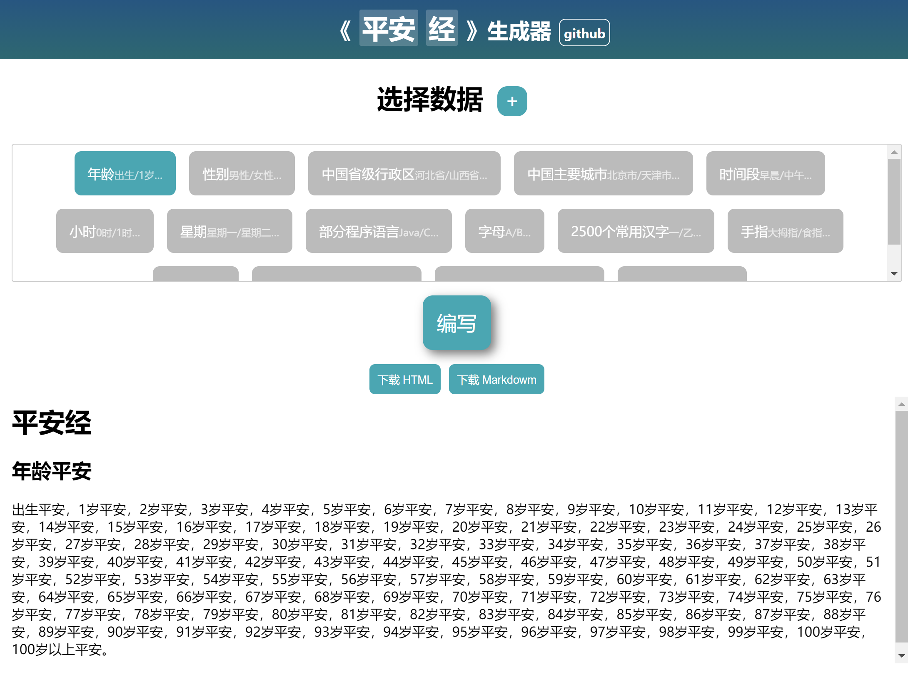

# 平安经生成器

[在线例子](https://aa11653.github.io/pinganjing/index.html)



一个方便大家快速祈求的**极其简单**的文本生成器。

**仅仅是一个非常单纯的生成器，请勿用于非法用途**

## 使用方法

1. 在标题处输入名称，例如 "发财"

2. 将数据纳入书中，可以点击加号手动添加

3. 点击编写，开始你的创作！

## 内置数据

由其他好的数据欢迎补充在 js/data.js 的 insetData 中，也可以用 js 语法生成。

在 data.js 中还提供了一个工具来辅助

```js
{
    title: "示例", // 显示在index中的名称
    data: ["a", "b", "c"] // 字符串数组，用于成书
}
```

## 其他

因为是临时有感写出，各种不完善还请谅解。（下手轻一点）部分数据来源于网络。
